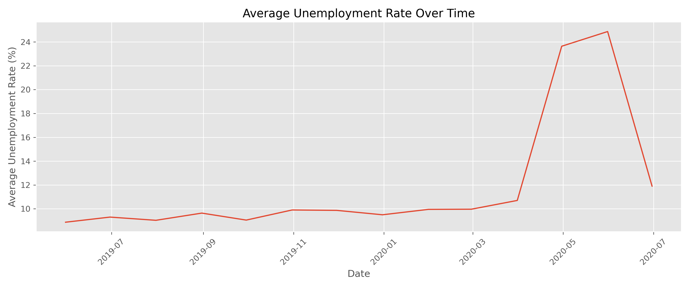
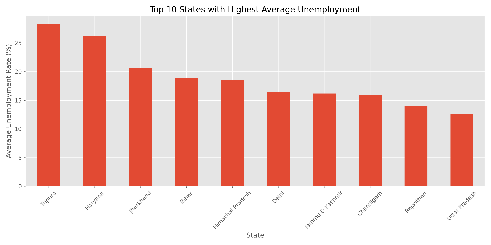
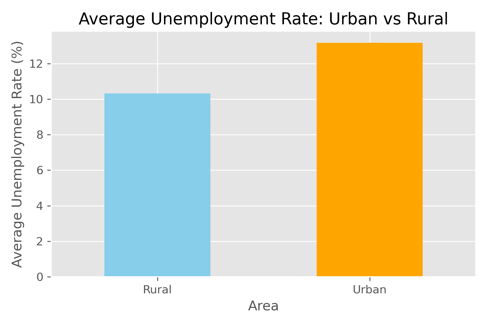
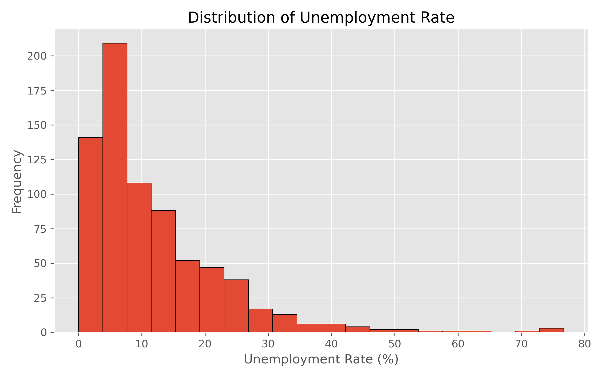

# 📊 Unemployment Analysis in India using Python

## 📌 Project Overview

This project analyzes unemployment trends in India using Python. The dataset was cleaned, explored, and visualized to understand unemployment patterns across different states, areas, and time periods.

The project focuses on identifying trends, comparing unemployment rates across regions, and understanding the impact of major events such as the COVID-19 pandemic.

---

## 🎯 Objectives

- Clean and preprocess the unemployment dataset
- Perform Exploratory Data Analysis (EDA)
- Analyze unemployment trends over time
- Compare unemployment across different states
- Compare Urban and Rural unemployment
- Visualize important insights

---

## 🛠 Technologies Used

- Python
- Pandas
- NumPy
- Matplotlib
- Jupyter Notebook

---

## 📂 Project Structure

```
Unemployment-Analysis-Python/
│
├── data/
│   ├── Unemployment in India.csv
│   └── Unemployment_Rate_upto_11_2020.csv
│
├── notebook/
│   └── unemployment_analysis.ipynb
│
├── images/
│
├── README.md
├── requirements.txt
└── .gitignore
```

---

## 📈 Key Insights

- Unemployment remained relatively stable during 2019.
- A significant spike in unemployment occurred during April–June 2020.
- Tripura recorded the highest average unemployment rate.
- Haryana recorded the second-highest average unemployment rate.
- Meghalaya recorded the lowest average unemployment rate.
- Urban unemployment was higher than Rural unemployment.
- Most unemployment rates were concentrated at lower values with a few extreme values.

---

## 📊 Visualizations

### Unemployment Trend Over Time



### State-wise Average Unemployment



### Urban vs Rural Comparison



### Distribution of Unemployment Rate



---

## 🚀 Future Improvements

- Build an interactive dashboard using Streamlit or Power BI.
- Add state-wise forecasting using Machine Learning.
- Include more recent unemployment datasets.

---

## 👨‍💻 Author

**Siri Moturi**