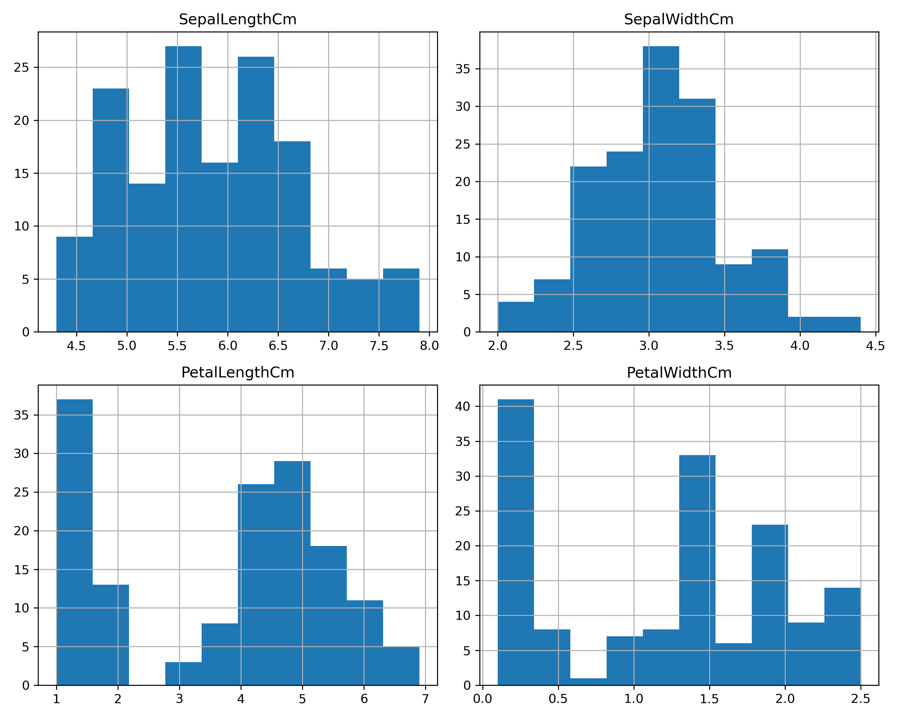
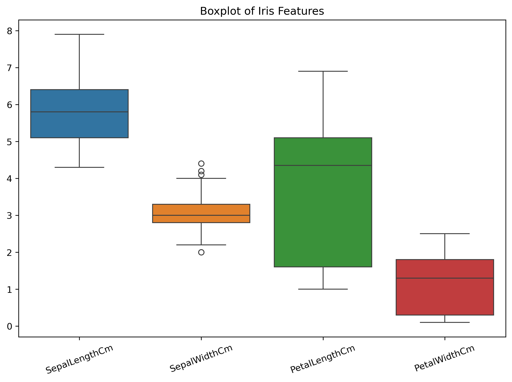
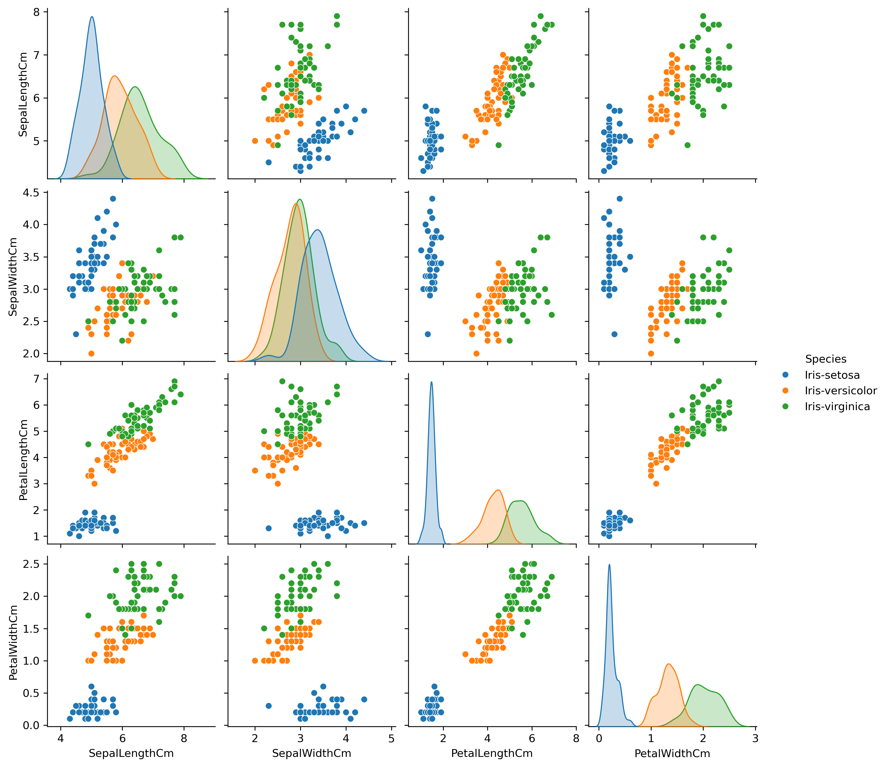
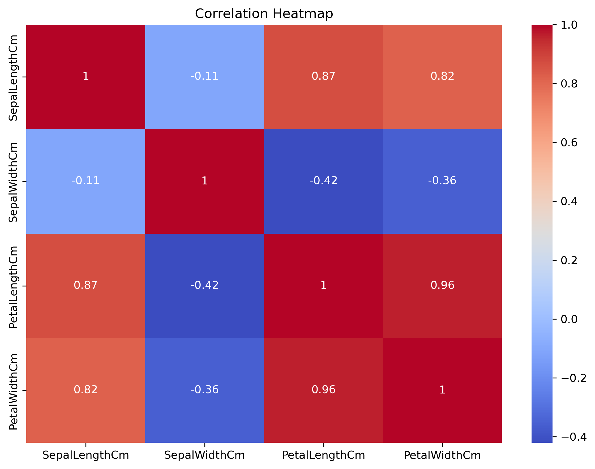
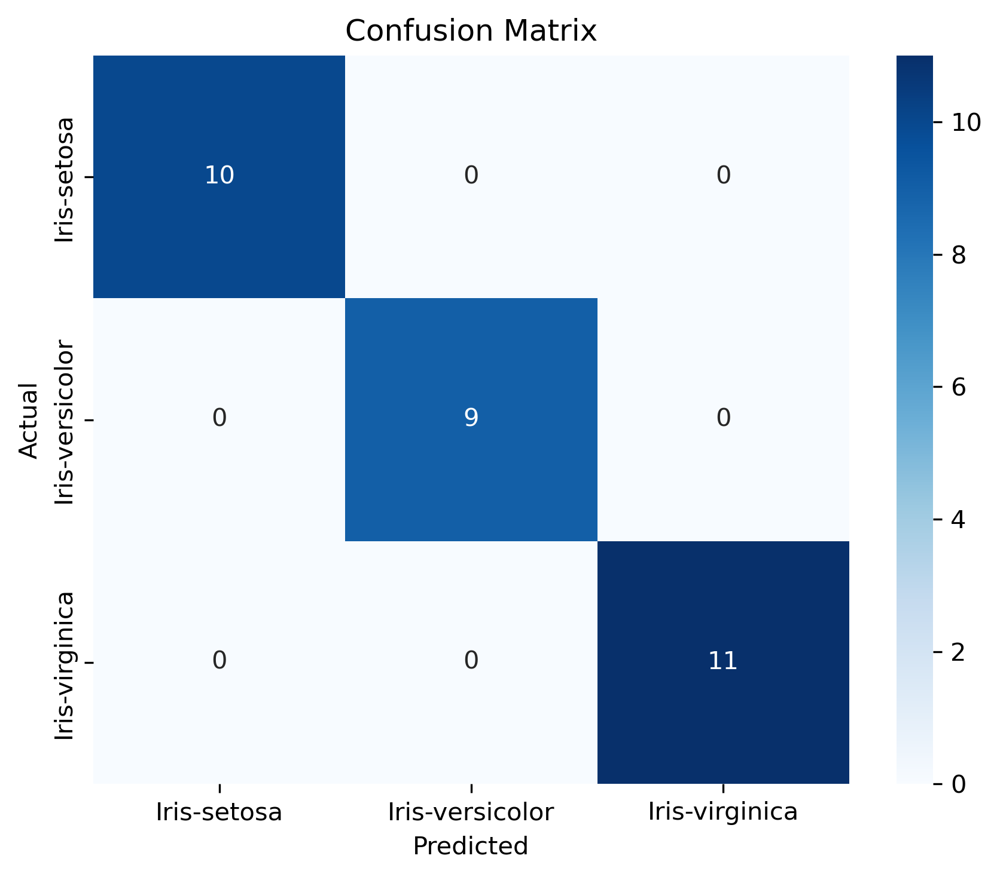

# 🌸 Iris Flower Classification using Machine Learning

## 📌 Project Overview

This project classifies Iris flowers into three species:

- Iris-setosa
- Iris-versicolor
- Iris-virginica

using the K-Nearest Neighbors (KNN) classification algorithm.

---

## 📂 Dataset

- 150 flower samples
- 4 numerical features
- 3 flower species

Features:

- Sepal Length
- Sepal Width
- Petal Length
- Petal Width

Target:

- Species

---

## 🛠 Technologies Used

- Python
- Pandas
- NumPy
- Matplotlib
- Seaborn
- Scikit-learn
- Jupyter Notebook

---

## 📊 Project Workflow

1. Load Dataset
2. Exploratory Data Analysis (EDA)
3. Data Visualization
4. Feature & Target Selection
5. Train-Test Split
6. KNN Model Training
7. Prediction
8. Model Evaluation
9. Conclusion

---

## 📈 Visualizations

### Histogram

### Boxplot

### Pairplot

### Correlation Heatmap

### Confusion Matrix

---

## 🎯 Model Performance

- High Accuracy on Test Data
- Confusion Matrix
- Classification Report

---

## 📚 Learning Outcomes

This project helped me understand:

- Exploratory Data Analysis
- Feature Selection
- Classification
- K-Nearest Neighbors
- Model Evaluation
- Accuracy
- Confusion Matrix